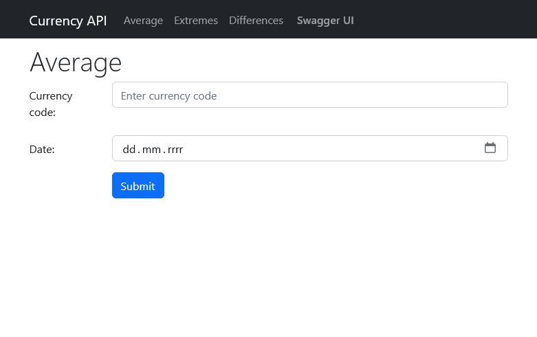

# Dynatrace Internship Task 2023
### Currency API

This is a solution to [Dynatrace Gdansk Backend Internship Task](https://github.com/joaquinfilipic-dynatrace/gdn-internship-2023).
It is a simple API that does basic operations on data from [NBP API](https://api.nbp.pl/).
The Web API was created using .NET 7 with ASP.NET Core. It is located in the [`backend`](./backend) folder.
This REST API implements the following endpoints:
- `GET /exchange/average/{code}` - returns the current exchange rate for the given currency code
- `GET /exchange/average/{code}/{date}` - returns the average exchange rate for the given currency code and date
- `GET /exchange/extremes/{code}/{quotations}` - returns the highest and lowest exchange rate for the given currency code and number of quotations
- `GET /exchange/maxBuyAskDifference/{code}/{quotations}` - returns the highest difference between buy and sell exchange rate for the given currency code and number of quotations

More information about the endpoints can be found in the Swagger UI [`/swagger/index.html`](http://localhost:5000/swagger/index.html).

All the data fetched from NBP API is memory cached - default cache expiration time is 15 minutes.
The project also contains basic unit and integration tests.

I have also created a simple frontend page that uses the API - it can be found in the [`frontend`](./frontend) folder.
It was created using React.js and TypeScript.


##### Configuration
By default, frontend is configured to use the API running on [`http://localhost:5000/`](http://localhost:5000/swagger/index.html).
If you want to change this, you can do so by editing the [`frontend/src/api/api.config.json`](./frontend/src/api/api.config.json) file.

---
### How to run the project
#### Using Docker
If you have Docker installed, you can run the project using the following command
while in the root directory:
```bash
docker-compose up
```
The API will be available at [`http://localhost:5000/`](http://localhost:5000/swagger/index.html).

The frontend page will be available at [`http://localhost:80/`](http://localhost:80/) and [`http://localhost:4000/`](http://localhost:4000/).

Swagger UI will be available at [`http://localhost:5000/swagger/index.html`](http://localhost:5000/swagger/index.html).

Notice: Both backend and frontend are running in release mode.

---
#### Without Docker
##### Backend
To run the backend, you need to have .NET 7 installed.
Then, you can run the project using the following command while in the root directory:
```bash
dotnet run --project ./backend/CurrencyApi --urls="http://localhost:5000/"
```
The API will be available at [`http://localhost:5000/`](http://localhost:5000/swagger/index.html).

Swagger UI will be available at [`http://localhost:5000/swagger/index.html`](http://localhost:5000/swagger/index.html).

##### Frontend
To run the frontend, you need to have Node.js installed.
Then, you can run the project using the following command while in the root directory:
```bash
cd frontend
npm install
npm start
```
Notice: this will start development server. If you want to build the project, use `npm run build`.

The frontend page will be available at [`http://localhost:3000/`](http://localhost:3000/).

---
### How to run tests
You can run the tests using the following command while in the root directory:
```bash
dotnet test ./backend/CurrencyApi.Tests
```

---
### Querying the API
- Get exchange rate for given currency code and date
```bash
curl http://localhost:5000/exchange/average/GBP/2023-01-02
```
<details>
    <summary>Example output</summary>

Should return:
```json
{
  "currencyCode": "GBP", 
  "date": "2023-01-02", 
  "exchangeRate": 5.2768
}
```
</details>

- Get min and max exchange rate for given currency code and number of quotations
```bash
curl http://localhost:5000/exchange/extremes/KRW/100
```
<details>
    <summary>Example output</summary>

Should return something similar to:
```json
{
  "currencyCode": "KRW",
  "quotations": 100,
  "minExchangeRate":
  {
    "date": "2023-04-24",
    "value": 0.00314
  },
  "maxExchangeRate":
  {
    "date": "2023-01-09",
    "value": 0.003534
  }
}
```
</details>

- Get max difference between buy and sell exchange rate for given currency code and number of quotations
```bash
curl http://localhost:5000/exchange/maxBuyAskDifference/EUR/255
```
<details>
    <summary>Example output</summary>

Should return something similar to:
```json
{
  "currencyCode": "EUR",
  "quotations": 255,
  "maxDifference":
  {
    "date": "2022-10-12",
    "value": 0.0974
  }
}
```
</details>

---
### Example

#### Average exchange rate
<details>
    <summary>Click to expand</summary>


</details>

#### Extreme exchange rate
<details>
    <summary>Click to expand</summary>


</details>

#### Max difference between buy and sell exchange rate
<details>
    <summary>Click to expand</summary>


</details>
